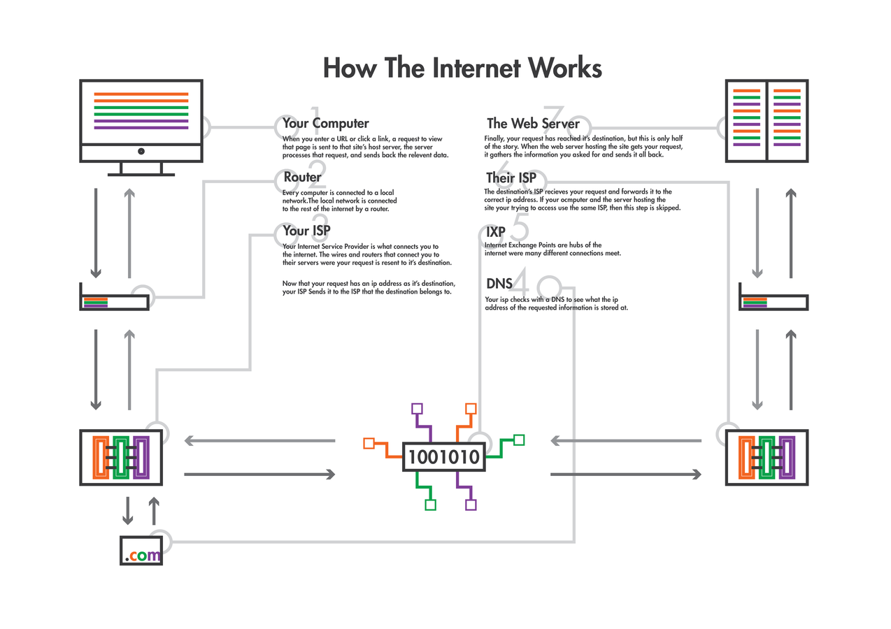

# readings

* 2-3 main points of the article
* 1 thing you didn't quite understand
* 1 question for the rest of the class to answer

////

1. Digital_Humanities, pages 3-16
2. Digital_Humanities, pages 16-26
3. "The Limits of the Digital Humanities"
4. "Defining Data for Humanists"


# DH, chap 1
* "humanities" as traditionally text-based disciplines
* digitization of print cultural record
* digital environment brings new conventions, need for standards, and a focus on design
* DH not a replacement for "traditional knowledge skills and methods"
* interfaces are important, but they can change, even with the same data
* collaboration is key
* vast and accessible digital archive changes way we learn

# "Limits"
* DH suffers from an identity crisis
* DH is overstating the effect the "digital"
* DH makes assumptions and observations that aren't grounded in facts
* DH seeks to make traditional humanities obsolete
* DH tools are only good for "understanding things in mass," they still require a knowledgeable scholar to ask the right questions
* DH should resist and critique the digital

# "Defining Data"
* Data is an artifact
* Data can be interpreted as texts
* Data can be computed/processed
* Data is not evidence on its own, but can be used as evidence
* Humanists can use their own skill-set and apply it to data

# 
<a href="https://thenextweb.com/insider/2015/02/16/ways-people-described-computers-1990s-hilarious/"></a>

# 

Credit: now defunct <a href="http://www.justinrominedesign.com/">http://www.justinrominedesign.com/</a>

# proof!
On a Mac:
```
* Type cmd + space to open Spotlight search
* Type "terminal" and hit enter
* Type "traceroute www.yourdomain.com"
* Type Control + C to cancel
```


On Windows:
```
* Search for "cmd.exe" program and open it.
* Type "tracert www.yourdomain.com"
* Type Control + C to cancel
```

# more proof!
<a href="http://www.submarinecablemap.com">http://www.submarinecablemap.com</a>

# what is all this stuff on CPanel? 
Using http://docs.reclaimhosting.com and Google, try to figure out what each of the icons is for in your CPanel.

* Table 1: Applications, Domains
* Table 2: Files, Email, Advanced
* Table 3: Databases, Metrics
* Table 4: Security, Software

Present back to the group on what you've learned

# HyperText Markup Language
```
<!DOCTYPE html>
<html>
<head>
<title>Page Title</title>
</head>
<body>

<h1>My First Heading</h1>
<p>My first paragraph.</p>

</body>
</html> 
```

# Cascading Style Sheets
```
body {
    background-color: #d0e4fe;
}

h1 {
    color: orange;
    text-align: center;
}

p {
    font-family: "Times New Roman";
    font-size: 20px;
}
```

# Activities
Complete activities 3-5 in Unit 0. 

# For Thursday 
* readings
* look over *Programming Historian* lessons
* finish up activities 3-5


