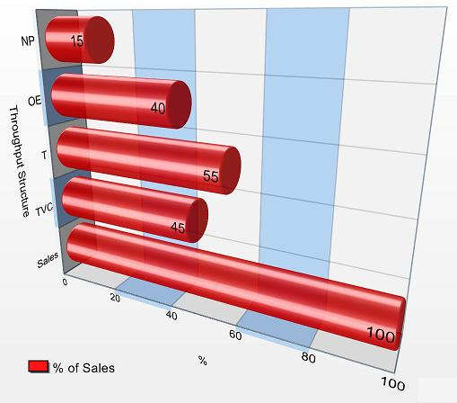

# Sit with your operating system! 

# data visualization 
> When first obtaining or creating a dataset, visualizations can be a valuable aid in understanding exactly what data are available and how they interconnect.

# what makes good data viz?

#

# 

# what makes good data viz?
* appropriate chart type
* reasonable colors
* labels/legend
* but not too crowded
* scaled for data 

# Data Viz Examples
* [http://www.datavizcatalogue.com](http://www.datavizcatalogue.com/)
* [https://pudding.cool/](https://pudding.cool/)
* [http://www.informationisbeautiful.net/](http://www.informationisbeautiful.net/)

# Text analysis tools
* Voyant
* AntConc
* [Topic Modeling Tool](https://senderle.github.io/topic-modeling-tool/documentation/2017/01/06/quickstart.html) and/or Mallet
* Python? Excel?

# Evaluation questions
* Who created this tool?
* What documentation is available?
* How do you input/output data? 
* What visualization options are available? 

# Project planning 
1. What is my research question or topic?
2. What are the biggest problems I have found with the data? What are realistic solutions?
3. What methods/tools am I interested in using?
4. What resources do I need?
5. What are my next steps? Break them down!
